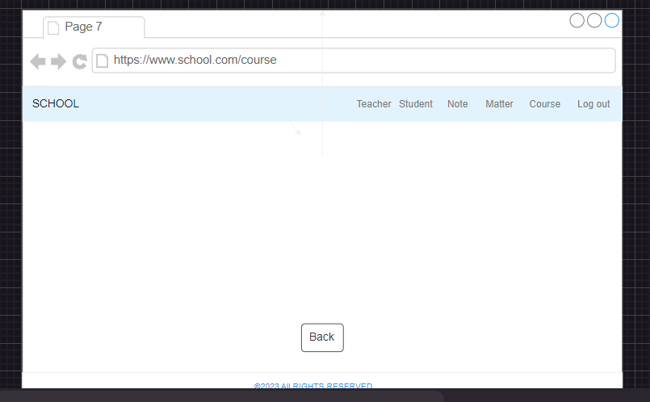
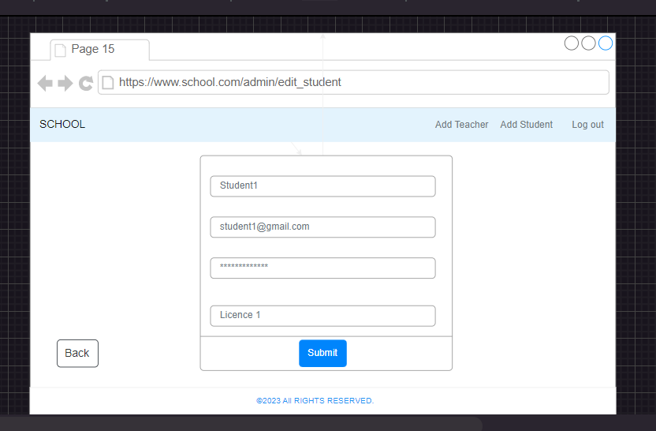

# School_Management

## Qu'est School_Management ?
School_management"" the grade menagement system is a project to develop a computer application for the efficient management of student grades.																			

## Language de programmmation et Framework
* Ruby version
3.0.1
* Rails version
6.0.3

## How to run the website

``` 
git clone https://github.com/drame/School_Management.git
 
cd School_Management

bundle install

yarn install --check-files

rails db:create && rails db:migrate
rails db:seed

rails s
```

## Catalog design and table definition
https://docs.google.com/spreadsheets/d/1J4GWJNQByz2T47D_m4k6zWUwluNQUNp_nVeR1p-l4LI/edit?usp=sharing
## wireframe







## Screen transition diagram


## ER diagramm


## Vous avez là le lien pour accéder aux diagrammes ER et de transitions d'écrans
https://drive.google.com/file/d/1rD--ZMH4qGH2_opvaVOiwbV8ieFffmfC/view?usp=sharing


* ...
